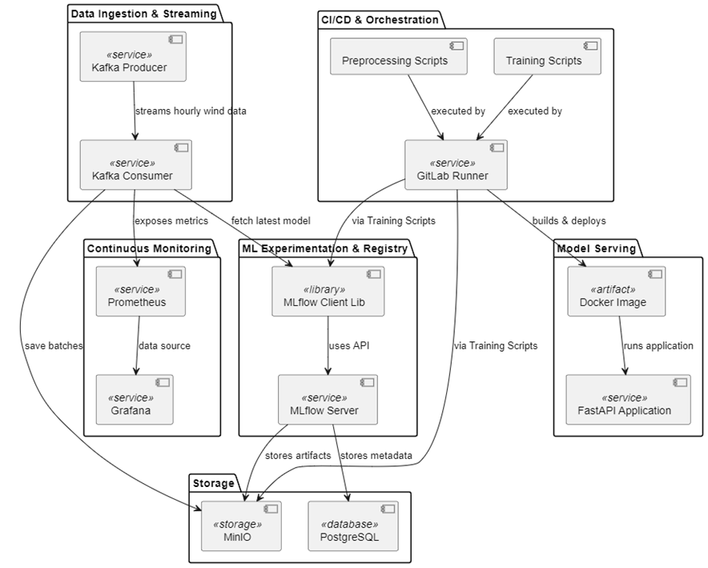

# MLOps for Renewable Energy Forecasting

This repository contains the Jupyter notebooks and supporting python scripts for my bachelor's thesis:

**"MLOps for Renewable Energy Forecasting"** (2025)

The objective of this is to build a modular MLOps pipeline for forecasting wind power using :

    - Open Power System Data (Germany)

    - Renewables.ninja weather features(wind speed, temperature, air density)

## Project Structure

| Folder | Description |
|--------|-------------|
| `notebooks/` | Jupyter notebooks for feature engineering, experiments, and scikit-learn model training |
| `src/` | Modular pipeline components: training scripts, batch ingestion logic, data preprocessing, model download for deployment, and CI/CD support |
| `kafka-scripts/` | Kafka producer and consumer scripts for streaming simulation |
| `drift/` | Drift detection scripts — downloads baseline vs latest batch statistics to enable statistical comparison |
| `dataset/` | Processed CSV dataset for Kafka streaming simulation (historical + incremental data) |
| `diagrams/` | Architecture and component diagrams |

## Technologies Used

- **Python**, scikit-learn, XGBoost
- **Jupyter Notebooks**
- **Docker + Docker Compose**
- **Apache Kafka** (streaming simulation)
- **MLflow** (experiment tracking)
- **MinIO** (object storage, S3-compatible)
- **PostgreSQL** (model metadata)
- **Prometheus & Grafana** (metric monitoring)
- **FastAPI** (model serving and API visualization)

## High-Level Architecture
### System Overview

### Component Diagram

## Current Stage

- End-to-end MLOps pipeline functional
- Containerized training, registry, and monitoring
- Kafka streaming with weekly batch simulation
- Drift baseline created (in progress — integrating statistical detection)