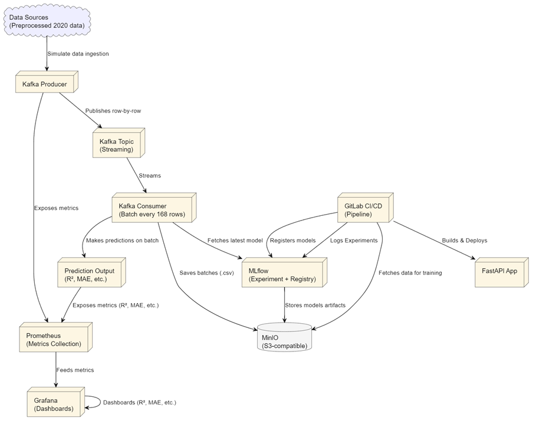

# MLOps for Renewable Energy Forecasting

This repository contains the Jupyter notebooks and supporting python scripts for my bachelor's thesis:

**"MLOps for Renewable Energy Forecasting"** (2025)

The objective of this is to build a modular MLOps pipeline for forecasting wind power using :

    - Open Power System Data (Germany)

    - Renewables.ninja weather features(wind speed, temperature, air density)

## Project Structure

| Folder | Description |
|--------|-------------|
| `notebooks/` | Jupyter notebooks for feature engineering, experiments, and scikit-learn model training |
| `src/` | Modular pipeline components: training scripts, batch ingestion logic, data preprocessing, model download for deployment, and CI/CD support |
| `kafka-scripts/` | Kafka producer and consumer scripts for streaming simulation |
| `drift/` | Drift detection scripts — downloads baseline vs latest batch statistics to enable statistical comparison |
| `dataset/` | Processed CSV dataset for Kafka streaming simulation (historical + incremental data) |
| `diagrams/` | Architecture and component diagrams |

## Technologies Used

- **Python**, scikit-learn, XGBoost
- **Jupyter Notebooks**
- **Docker + Docker Compose**
- **Apache Kafka** (streaming simulation)
- **MLflow** (experiment tracking)
- **MinIO** (object storage, S3-compatible)
- **PostgreSQL** (model metadata)
- **Prometheus & Grafana** (metric monitoring)
- **FastAPI** (model serving and API visualization)

## High-Level Architecture
### System Overview

### Component Diagram

## Current Stage

- End-to-end MLOps pipeline functional
- Containerized training, registry, and monitoring
- Kafka streaming with weekly batch simulation
- Drift baseline created (in progress — integrating statistical detection)

## License

MIT License

Copyright (c) 2025 Chirita Gabriel

Permission is hereby granted, free of charge, to any person obtaining a copy
of this software and associated documentation files (the "Software"), to deal
in the Software without restriction, including without limitation the rights
to use, copy, modify, merge, publish, distribute, sublicense, and/or sell
copies of the Software, and to permit persons to whom the Software is
furnished to do so, subject to the following conditions:

The above copyright notice and this permission notice shall be included in all
copies or substantial portions of the Software.

THE SOFTWARE IS PROVIDED "AS IS", WITHOUT WARRANTY OF ANY KIND, EXPRESS OR
IMPLIED, INCLUDING BUT NOT LIMITED TO THE WARRANTIES OF MERCHANTABILITY,
FITNESS FOR A PARTICULAR PURPOSE AND NONINFRINGEMENT. IN NO EVENT SHALL THE
AUTHORS OR COPYRIGHT HOLDERS BE LIABLE FOR ANY CLAIM, DAMAGES OR OTHER
LIABILITY, WHETHER IN AN ACTION OF CONTRACT, TORT OR OTHERWISE, ARISING FROM,
OUT OF OR IN CONNECTION WITH THE SOFTWARE OR THE USE OR OTHER DEALINGS IN THE
SOFTWARE.